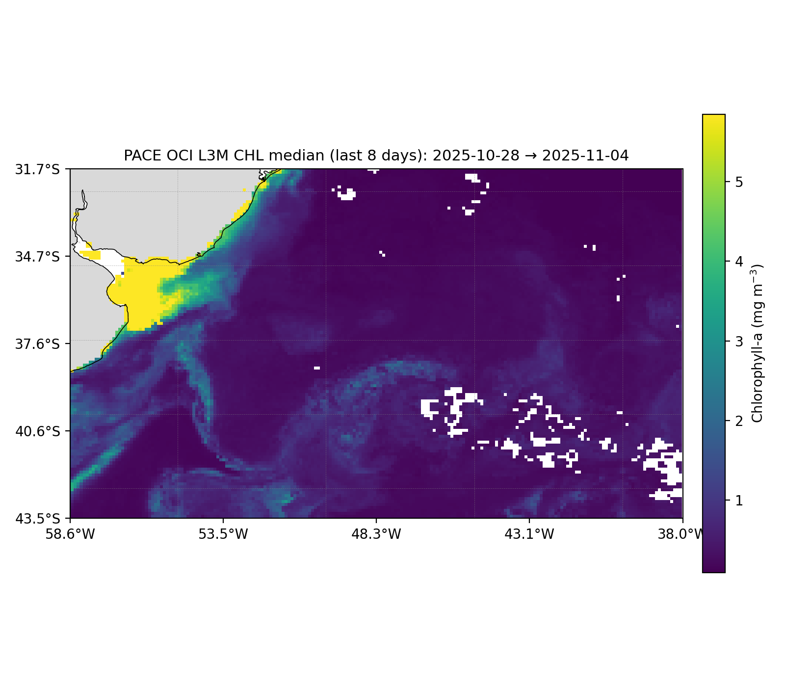

SPARC Cruise Context: Argo & PACE Data

This repository contains regularly updated figures derived from Argo float and NASA PACE satellite observations for the SPARC study region, located off the coast of Uruguay.

The figures provide environmental context for the SPARC research cruise, combining autonomous in situ and satellite remote sensing observations to track upper-ocean physical and biological variability.

## Quick Links
- 🔹 [Combined latest (float + satellite)](figs/latest/)
- 🔹 [Latest floats only](figs/latest_float/)
- 🔹 [Latest satellite only](figs/latest_sat/)
- 📚 [Archives index](figs/README.md)

<!-- SPARC_CONTEXT_PREVIEWS -->

### Latest Previews

**Floats**
   

**Satellite**
   

<!-- SPARC_CONTEXT_PREVIEWS -->
NA
<!-- SPARC_CONTEXT_PREVIEWS -->
